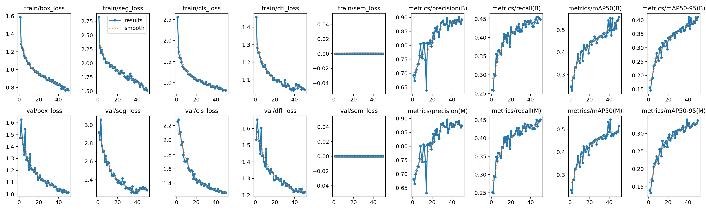
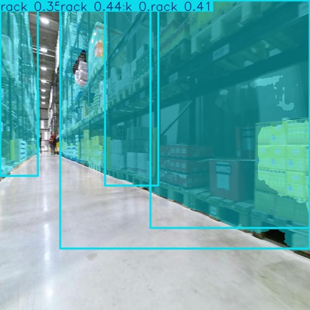
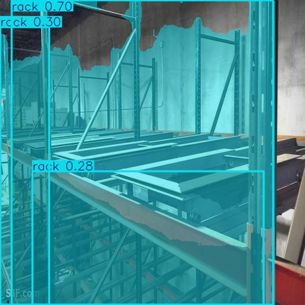

# Warehouse Segmentation for AMR Navigation

## Overview

This project presents a YOLOv8 Segmentation model developed for warehouse environment understanding in Autonomous Mobile Robot (AMR) systems.

The model is trained to detect and segment warehouse racks and storage boxes, enabling robots to better understand their surroundings and support autonomous navigation in industrial environments.

---

## Project Objectives

- Detect warehouse racks in real-time.
- Detect storage boxes in warehouse environments.
- Segment objects with pixel-level accuracy.
- Support AMR localization and navigation.
- Enhance obstacle awareness and warehouse mapping.

---

## Technologies Used

- Python
- YOLOv8 Segmentation
- PyTorch
- OpenCV
- NumPy
- Kaggle
- ONNX Export

---

## Dataset

Custom warehouse dataset containing two classes:

| Class ID | Class Name |
|-----------|------------|
| 0 | Box |
| 1 | Rack |

The dataset includes images collected from warehouse environments and was prepared in YOLO segmentation format.

---

## Model Training

### Model
- YOLOv8n-Seg

### Training Configuration
- Epochs: 50
- Image Size: 640 × 640
- Framework: Ultralytics YOLOv8
- Platform: Kaggle GPU

---

## Performance Metrics

### Bounding Box Metrics

| Metric | Value |
|----------|----------|
| Precision | ~0.89 |
| Recall | ~0.45 |
| mAP50 | ~0.55 |
| mAP50-95 | ~0.41 |

### Segmentation Metrics

| Metric | Value |
|----------|----------|
| Precision | ~0.89 |
| Recall | ~0.45 |
| mAP50 | ~0.55 |
| mAP50-95 | ~0.34 |

---

## Training Results



---

## Sample Predictions

### Prediction 1



### Prediction 2



---

## Repository Structure

```text
warehouse-segmentation-for-amr-navigation
│
├── assets
│   ├── prediction_1.jpg
│   └── prediction_2.jpg
│
├── results
│   ├── results.png
│   ├── confusion_matrix.png
│   ├── confusion_matrix_normalized.png
│   ├── BoxF1_curve.png
│   ├── BoxPR_curve.png
│   ├── BoxP_curve.png
│   ├── BoxR_curve.png
│   ├── MaskF1_curve.png
│   ├── MaskPR_curve.png
│   ├── MaskP_curve.png
│   └── MaskR_curve.png
│
├── weights
│   ├── best.pt
│   ├── last.pt
│   └── best.onnx
│
└── warehouse-segmentation-for-amr-navigation.ipynb
```

---

## Applications

This model can be integrated into:

- Autonomous Mobile Robots (AMR)
- Smart Warehouses
- Inventory Monitoring Systems
- Warehouse Automation
- Industrial Robotics
- Intelligent Navigation Systems

---

## Future Improvements

- Increase dataset size.
- Improve segmentation accuracy.
- Train larger YOLOv8 models.
- Deploy on Raspberry Pi.
- Integrate with ROS2 Navigation Stack.
- Real-time inference on AMR platforms.

---

## Model Weights

Available in:

```text
weights/best.pt
weights/best.onnx
```

The ONNX model can be deployed on edge devices and industrial systems.

---

## Author

### Fares Elgohary

Mechatronics Engineer | AI & Data Science Engineer

Skills:
- Machine Learning
- Deep Learning
- Computer Vision
- YOLOv8
- ROS2
- Autonomous Mobile Robots (AMR)
- Python
- PyTorch

LinkedIn:
(Add your LinkedIn profile here)

GitHub:
https://github.com/fareselgohary2003

---

## License

This project is released for educational and research purposes.
